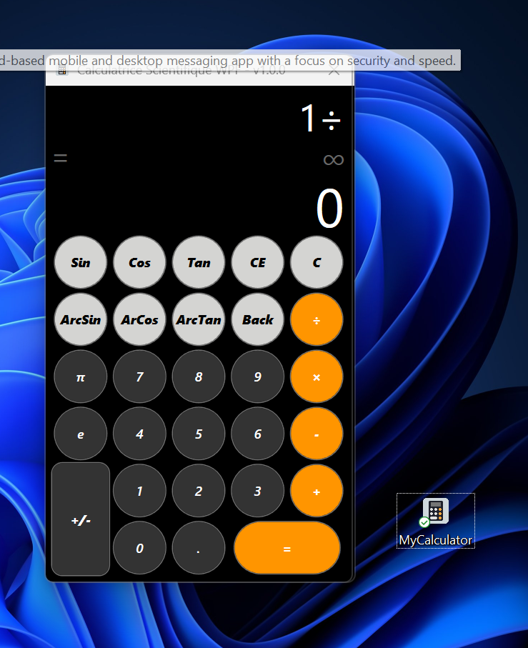

# Simply Calc - Calculatrice Scientifique WPF


Une calculatrice scientifique moderne développée en WPF (.NET 8.0) avec une architecture propre et maintenable utilisant le pattern **Partial Classes** pour une séparation optimale des responsabilités.

## Table des matières

- [Aperçu](#-aperçu)
- [Fonctionnalités](#-fonctionnalités)
- [Architecture](#-architecture)
- [Structure du projet](#-structure-du-projet)
- [Installation](#-installation)
- [Utilisation](#-utilisation)
- [Technologies](#-technologies)
- [Déploiement](#-déploiement)
- [Contribution](#-contribution)

## Aperçu

Simply Calc est une calculatrice scientifique complète offrant des opérations arithmétiques de base, des fonctions trigonométriques et la gestion de constantes mathématiques. L'application suit les principes SOLID et utilise une architecture modulaire pour faciliter la maintenance et l'évolution.

### Capture d'écran




### Interface ASCII
```
┌─────────────────────────────────────┐
│  Simply Calc - v1.0.0               │
├─────────────────────────────────────┤
│  sin(45)+cos(30)×π                  │  ← Zone d'opération
│  = 4.23594                          │  ← Résultat intermédiaire
│  4.23594                            │  ← Résultat principal
├─────────────────────────────────────┤
│  [Sin] [Cos] [Tan] [CE]  [C]       │
│  [Arc] [Arc] [Arc] [Bck] [÷]       │
│  [ π ] [ 7 ] [ 8 ] [ 9 ] [×]       │
│  [ e ] [ 4 ] [ 5 ] [ 6 ] [-]       │
│  [+/-] [ 1 ] [ 2 ] [ 3 ] [+]       │
│  [+/-] [ 0 ] [ . ] [   =   ]       │
└─────────────────────────────────────┘
```

## Fonctionnalités

### Opérations de base
- Addition, soustraction, multiplication, division
- Gestion des nombres décimaux
- Changement de signe (+/-)
- Effacement (CE / C / Back)

### Fonctions scientifiques
- **Trigonométrie directe** : sin, cos, tan (en degrés)
- **Trigonométrie inverse** : arcsin, arccos, arctan
- **Constantes** : π (Pi), e (Euler)
- Conversion automatique degrés ↔ radians

### Interface utilisateur
- Interface WPF moderne et responsive
- Ajustement dynamique de la taille de police
- Gestion des erreurs avec affichage visuel
- Support clavier complet
- Thème sombre élégant
- Icône personnalisée

### Fonctionnalités avancées
- Historique des calculs avec export CSV/JSON/TXT
- Validation des expressions en temps réel
- Gestion des parenthèses automatique
- Calcul en chaîne
- Logs d'erreurs détaillés
- Lanceur discret (VBS/BAT)

## Architecture

### Pattern Partial Classes

L'application utilise intensivement les **partial classes** pour séparer les responsabilités de la fenêtre principale :

```
MainWindow
├── MainWindow.xaml.cs          (Constructeur et initialisation)
│
└── UI/ (Partial Classes)
    ├── MainWindowState.cs          (État et services)
    ├── MainWindowOperator.cs       (Opérateurs arithmétiques)
    ├── MainWindowFunction.cs       (Fonctions scientifiques)
    ├── MainWindowSpecialKey.cs     (Touches spéciales)
    ├── MainWindowCompute.cs        (Moteur de calcul)
    ├── MainWindowDisplay.cs        (Gestion de l'affichage)
    └── MainWindowEventHandler.cs   (Gestionnaires d'événements)
```

### Principes de conception

- **Separation of Concerns** : Chaque partial class a une responsabilité unique
- **DRY (Don't Repeat Yourself)** : Code réutilisable via helpers et services
- **Single Responsibility Principle** : Classes cohésives avec un seul objectif
- **Dependency Injection** : Services injectés via constructeur
- **Error Handling** : Gestion centralisée des erreurs

## Structure du projet

```
Simply-Calc_AppWPF/
│
├── 📂 bin/                           # Fichiers compilés
│   ├── Debug/net8.0-windows/        # Build Debug
│   │   ├── Simply-Calc_AppWPF.exe   # Exécutable Debug
│   │   ├── Simply-Calc_AppWPF.dll   # (107 KB)
│   │   └── Simply-Calc_AppWPF.pdb   # Symboles Debug
│   └── Release/net8.0-windows/      # Build Release
│       ├── Simply-Calc_AppWPF.exe   # Exécutable Release
│       ├── Simply-Calc_AppWPF.dll   # (97 KB - Optimisé)
│       └── Simply-Calc_AppWPF.pdb   # Symboles Release
│
├── 📂 core/                          # Logique métier principale
│   ├── CalculatorEngine.cs          # Moteur de calcul (12 KB)
│   ├── Constants.cs                 # Constantes globales (13 KB)
│   └── OperationHistory.cs          # Historique des opérations (17 KB)
│
├── 📂 Models/                        # Modèles de données
│   ├── CalculatorState.cs           # État de la calculatrice (13 KB)
│   └── OperatorType.cs              # Types d'opérateurs (9 KB)
│
├── 📂 Services/                      # Services applicatifs
│   ├── ErrorHandler.cs              # Gestion des erreurs (20 KB)
│   ├── ExpressionEvaluator.cs       # Évaluation d'expressions (16 KB)
│   └── FunctionRegistry.cs          # Registre des fonctions (17 KB)
│
├── 📂 Helpers/                       # Classes utilitaires
│   ├── FormattingHelper.cs          # Formatage des nombres (7 KB)
│   ├── MathHelper.cs                # Opérations mathématiques (9 KB)
│   └── ParsingHelper.cs             # Parsing et validation (12 KB)
│
├── 📂 UI/                            # Partial classes UI
│   ├── MainWindowState.cs           # Variables d'état (8 KB)
│   ├── MainWindowOperator.cs        # Logique opérateurs (4 KB)
│   ├── MainWindowFunction.cs        # Logique fonctions (10 KB)
│   ├── MainWindowSpecialKey.cs      # Touches spéciales (9 KB)
│   ├── MainWindowCompute.cs         # Calculs (2 KB)
│   ├── MainWindowDisplay.cs         # Affichage (7 KB)
│   └── MainWindowEventHandler.cs    # Événements (14 KB)
│
├── 📂 Ressources/                    # Ressources graphiques
│   ├── Demo.png                     # Capture d'écran (457 KB)
│   ├── icons8-calculator-480.ico    # Icône de l'application
│   ├── Launcher.bat                 # Script de lancement
│   ├── launch_cach.vbs              # Lanceur discret
│   └── Simply_Calc.exe.lnk          # Raccourci Windows
│
├── 📂 log/                           # Journaux d'application
│   ├── error.log                    # Logs d'erreurs
│   └── Operation.log                # Logs des opérations
│
├── 📂 obj/                           # Fichiers temporaires de compilation
│   ├── Debug/net8.0-windows/        # Objets Debug
│   └── Release/net8.0-windows/      # Objets Release
│
├── MainWindow.xaml                   # Interface XAML (6 KB)
├── MainWindow.xaml.cs                # Code-behind principal (7 KB)
├── App.xaml                          # Configuration application (5 KB)
├── App.xaml.cs                       # Point d'entrée (3 KB)
├── AssemblyInfo.cs                   # Informations d'assembly
├── Simply-Calc_AppWPF.csproj         # Fichier projet (.6 KB)
├── Simply-Calc_AppWPF.sln            # Solution Visual Studio
├── .gitignore                        # Configuration Git (6 KB)
├── .gitattributes                    # Attributs Git (2 KB)
└── README.md                         # Documentation (12 KB)
```

### 📊 Statistiques du projet

| Catégorie | Nombre de fichiers | Taille totale |
|-----------|-------------------|---------------|
| **Code source (.cs)** | 23 | ~220 KB |
| **XAML** | 2 | ~12 KB |
| **Ressources** | 5 | ~465 KB |
| **Exécutables** | 2 (Debug/Release) | ~253 KB |
| **Documentation** | 1 | ~13 KB |
| **Total** | ~33 fichiers principaux | ~963 KB |

## Installation

### Prérequis

- **Windows 10/11** (64-bit)
- **.NET 8.0 SDK** ou supérieur
- **Visual Studio 2022** (recommandé) ou VS Code
- **Git** (optionnel)

### Étapes d'installation

1. **Cloner le dépôt**
```bash
git clone https://github.com/KryssSampi/Simply-Calc_AppWPF.git
cd Simply-Calc_AppWPF
```

2. **Restaurer les packages NuGet**
```bash
dotnet restore
```

3. **Compiler le projet**

**Mode Debug**
```bash
dotnet build --configuration Debug
```

**Mode Release (Optimisé)** :* :
```bash
dotnet build --configuration Release
```

4. **Exécuter l'application**

**Depuis le terminal** :
```bash
dotnet run
```

**Ou directement** : 
```bash
# Debug
.\bin\Debug\net8.0-windows\Simply-Calc_AppWPF.exe

# Release (Recommandé)
.\bin\Release\net8.0-windows\Simply-Calc_AppWPF.exe
```

### Installation via Visual Studio

1. Ouvrir `Simply-Calc_AppWPF.sln` dans Visual Studio 2022
2. Sélectionner la configuration (Debug/Release)
3. Appuyer sur `F5` pour compiler et exécuter

## Utilisation

### Opérations de base

```
Exemples :
  5 + 3         →  8
  10 - 4        →  6
  7 × 8         →  56
  20 ÷ 4        →  5
  -5 + 3        →  -2
```

### Fonctions scientifiques

```
Exemples :
  sin(30)       →  0.5
  cos(60)       →  0.5
  tan(45)       →  1
  arcsin(0.5)   →  30
  π × 2         →  6.283185
  e × 3         →  8.154845
```

### Expressions complexes

```
Exemples :
  sin(45) + cos(30) × π    →  4.23594
  3 × (4 + 5)              →  27
  arctan(1) × 4            →  180
```

### Raccourcis clavier

| Touche | Action |
|--------|--------|
| `0-9` | Saisie de chiffres |
| `+ - * /` | Opérateurs |
| `.` ou `,` | Point décimal |
| `Enter` | Égal (=) |
| `Backspace` | Supprimer dernier caractère |
| `Delete` | Clear Entry (CE) |
| `Escape` | Clear All (C) |
| `F9` | Changement de signe |
| `Ctrl+S` | sin |
| `Ctrl+C` | cos |
| `Ctrl+T` | tan |
| `Ctrl+P` | π |
| `Ctrl+E` | e |

## Technologies

### Framework et langages
- **.NET 8.0** - Framework applicatif
- **C# 12.0** - Langage de programmation
- **WPF (Windows Presentation Foundation)** - Interface utilisateur
- **XAML** - Markup interface

### Librairies
- `System.Windows` - Framework WPF
- `System.Globalization` - Gestion des formats numériques
- `System.IO` - Gestion des fichiers (logs, exports)

### Outils de développement
- **Visual Studio 2022** - IDE
- **Git** - Contrôle de version
- **MSBuild** - Système de compilation

### Patterns et concepts
- **Partial Classes** - Séparation des responsabilités
- **MVVM-like** - État séparé de la logique UI
- **Service Pattern** - Services réutilisables
- **Repository Pattern** - Historique des opérations
- **Strategy Pattern** - Fonctions et opérateurs

## Déploiement

### Build Release

Pour créer une version optimisée pour la production :

```bash
dotnet publish -c Release --self-contained false -r win-x64
```

L'exécutable sera généré dans :
```
bin/Release/net8.0-windows/
```

### Création d'un installeur

Le projet inclut plusieurs options de lancement :

1. **Exécutable direct** : `Simply-Calc_AppWPF.exe`
2. **Script batch** : `Ressources/Launcher.bat`
3. **Lanceur discret VBS** : `Ressources/launch_cach.vbs` (sans console)
4. **Raccourci Windows** : `Ressources/Simply_Calc.exe.lnk`

### Configuration de l'icône

L'icône de l'application est définie dans le fichier `.csproj` :
```xml
<ApplicationIcon>Ressources\icons8-calculator-480.ico</ApplicationIcon>
```

## Diagrammes

### Flux de calcul

```
┌──────────────┐
│ Saisie User  │
└──────┬───────┘
       │
       ▼
┌──────────────────┐
│ Validation Input │
└──────┬───────────┘
       │
       ▼
┌─────────────────┐
│ Parsing/Tokenize│
└──────┬──────────┘
       │
       ▼
┌──────────────────┐
│ CalculatorEngine │
└──────┬───────────┘
       │
       ▼
┌───────────────┐
│ Formatage     │
└──────┬────────┘
       │
       ▼
┌──────────────┐
│ Affichage    │
└──────────────┘
```

### Architecture des composants

```
┌─────────────────────────────────────────┐
│            MainWindow (UI)              │
│  ┌───────────────────────────────────┐  │
│  │  Partial Classes (UI/)            │  │
│  │  - State, Operator, Function      │  │
│  │  - SpecialKey, Compute, Display   │  │
│  │  - EventHandler                   │  │
│  └───────────────────────────────────┘  │
└──────────────┬──────────────────────────┘
               │
               │ utilise
               ▼
┌──────────────────────────────────────────┐
│         Services Layer                   │
│  ┌────────────────────────────────────┐  │
│  │ • CalculatorEngine                 │  │
│  │ • ErrorHandler                     │  │
│  │ • ExpressionEvaluator              │  │
│  │ • FunctionRegistry                 │  │
│  │ • OperationHistory                 │  │
│  └────────────────────────────────────┘  │
└──────────────┬───────────────────────────┘
               │
               │ utilise
               ▼
┌──────────────────────────────────────────┐
│         Helpers & Models                 │
│  ┌────────────────────────────────────┐  │
│  │ • FormattingHelper                 │  │
│  │ • MathHelper                       │  │
│  │ • ParsingHelper                    │  │
│  │ • CalculatorState                  │  │
│  │ • OperatorType                     │  │
│  └────────────────────────────────────┘  │
└──────────────────────────────────────────┘
```

## Logs et debugging

L'application génère automatiquement des logs dans le dossier `log/` :

```
log/
├── error.log        # Logs d'erreurs critiques
└── Operation.log    # Historique des opérations
```

Format des logs d'erreurs :
```
[2025-10-14 23:44:15] [ERROR] Division par zéro
Contexte: Expression: 5/0
Stack Trace: ...
```

## Tests

```bash
# Exécuter les tests unitaires (à venir)
dotnet test
```

## Contribution

Les contributions sont les bienvenues ! Voici comment contribuer :

1. **Fork** le projet
2. Créer une **branche** (`git checkout -b feature/AmazingFeature`)
3. **Commit** les changements (`git commit -m 'Add AmazingFeature'`)
4. **Push** vers la branche (`git push origin feature/AmazingFeature`)
5. Ouvrir une **Pull Request**

### Guidelines de code

- Suivre les conventions de nommage C#
- Documenter avec XML comments
- Respecter l'architecture en partial classes
- Ajouter des tests unitaires pour les nouvelles fonctionnalités
- Maintenir la cohérence avec l'organisation des dossiers

## Licence

Ce projet est sous licence **MIT** - voir le fichier [LICENSE](LICENSE) pour plus de détails.

## Auteur

**Moi : ``Kryss Nana`` .**
- GitHub: [Kryss Nana](https://github.com/KryssSampi)
- Email: [Kryss Nana Mail](SampiKryss@gmail.com)

## Remerciements

- Microsoft pour le framework .NET et WPF
- Icons8 pour l'icône de calculatrice
- La communauté C# pour les ressources et l'inspiration
- Tous les contributeurs du projet

## Roadmap

### Version 1.1 (À venir)
- [ ] Mode scientifique avancé (log, ln, exp, puissance)
- [ ] Mode programmeur (binaire, hexadécimal)
- [ ] Thèmes personnalisables (clair/sombre)
- [ ] Support multi-langue (FR/EN)
- [ ] Tests unitaires complets

### Version 1.2 (Futur)
- [ ] Graphiques de fonctions
- [ ] Résolution d'équations
- [ ] Calcul matriciel
- [ ] Mode RPN (Notation Polonaise Inverse)
- [ ] Historique persistant entre sessions

### Version 2.0 (Long terme)
- [ ] Mode tablette tactile
- [ ] Synchronisation cloud
- [ ] Plugins extensibles
- [ ] API REST

## Problèmes connus

- La division par zéro est gérée mais affiche "Impossible"
- Les très grands nombres passent en notation scientifique
- Le support des parenthèses imbriquées est limité à un niveau
- Les logs peuvent devenir volumineux avec le temps

## Dépannage

### L'application ne démarre pas
- Vérifier que .NET 8.0 Runtime est installé
- Exécuter en mode administrateur si nécessaire
- Vérifier les logs dans le dossier `log/`

### Erreurs de calcul
- Consulter `log/error.log` pour les détails
- Vérifier la syntaxe de l'expression
- Essayer avec l'effacement complet (C)

### Problèmes de performance
- Utiliser la version Release plutôt que Debug
- Vider l'historique périodiquement
- Nettoyer les anciens logs

## Support

Pour toute question ou problème :
- Ouvrir une [issue](https://github.com/votre-username/Simply-Calc_AppWPF/issues)
- Consulter la [documentation](https://github.com/votre-username/Simply-Calc_AppWPF/wiki)
- Email: support@example.com

## 📚 Documentation supplémentaire

- [Guide de contribution](CONTRIBUTING.md)
- [Journal des modifications](CHANGELOG.md)
- [Guide de style](STYLE_GUIDE.md)

---

**⭐ Si vous aimez ce projet, n'hésitez pas à lui donner une étoile !**

*Fait avec ❤️ en C# et WPF*

**Version:** 1.0.0